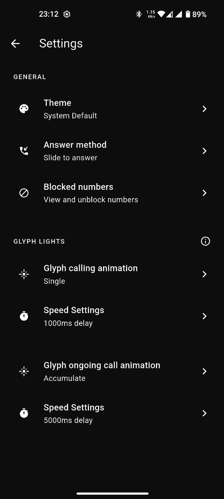
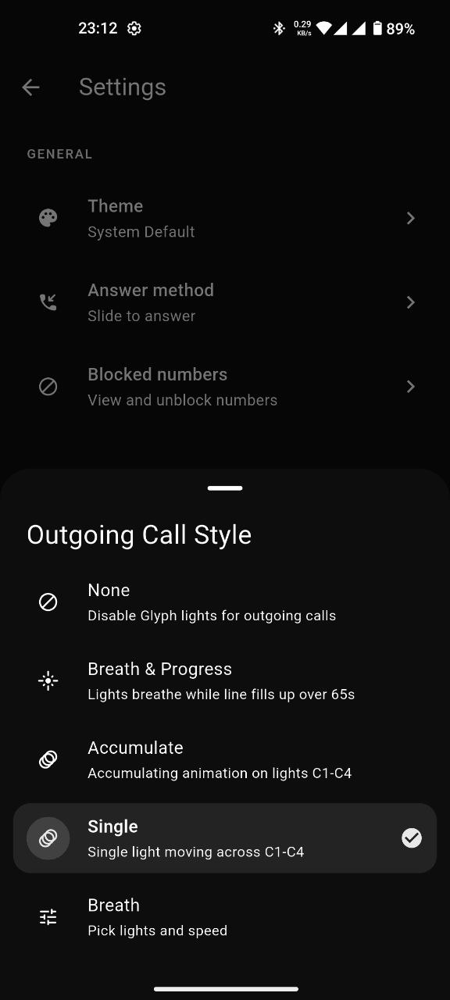
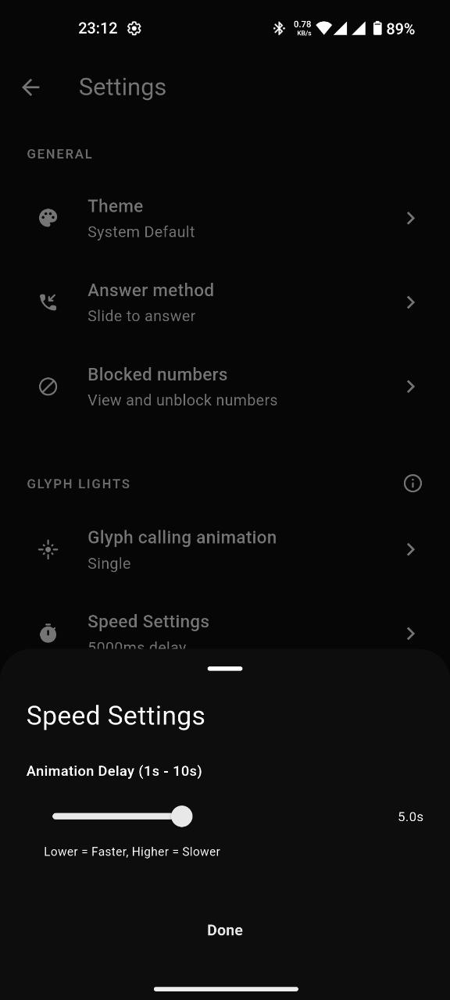

# Nothing Dialer

## The Ultimate Dialer App for Nothing Phone 1


Nothing Dialer is a next-generation dialer app built exclusively for Nothing Phone 1. It combines a clean, modern interface with advanced call management, contact integration, and unique Glyph animations that make every call experience special. Designed for speed, reliability, and seamless integration with Nothing hardware. Brought the UI/UX features we liked from other dialer apps.

**Current version:** 1.0.0+6

---

## What's new (recent releases)

- **Voice search** — Speak to fill the search field on Recents and Contacts (Android speech recognizer via native bridge).
- **Favourites** — Star numbers from contact details, reorder and manage them under Settings, and optionally show a horizontal favourites row on Recents when search is empty.
- **Recents** — Filters (all, missed, contacts-only, non-contacts), configurable “frequently contacted” section, and tighter integration with call state refresh after calls end.
- **Build & platform** — Release signing configuration for Android, ProGuard rules for the Nothing Glyph SDK, adaptive launcher icons, and App Actions shortcut metadata for call intents (`com.rkkvishva.nothing_dialer`).
- **Glyph** — Uses [`nothing_glyph_interface`](https://github.com/rkvishwa/flutter-nothing-glyph-interface) from source (display progress and toggle fixes on the tracked branch).

---

## Screenshots

<p align="center">
  
  
  
</p>

---

**Coming Soon:**

- Future support for other Nothing phones
- Official release on Google Play Store

---

## Closed testing

To join closed testing, request access to the **[Nothing Dialer 1 - Testers](https://groups.google.com/u/2/g/nothing-dialer-1---testers)** group on Google Groups. If you cannot see conversations yet, contact the group owners for approval or using the email support@knurdz.org

---

## Features

- Default Dialer role support (can be set as the system phone app)
- Minimal and advanced dialpad screens
- Call history grouped by number and type (like Google Phone), with filters and frequent-contact highlights
- Contact sync and search (device address book), including voice search
- Blocked numbers management
- SIM picker for dual SIM devices
- Favourites: star from contact detail, full list in Settings, optional Recents strip
- Floating dialpad with advanced features:
	- Sub-label letters on keys (ABC, DEF, etc.)
	- Long-press actions (0 for '+', 1 for voicemail)
	- Backspace long-press clears all
	- Paste from clipboard
	- Auto phone-number formatting
	- Animated entrance/exit
	- Haptic feedback
	- Pulsing call button
- Call placement via MethodChannel (native integration)
- Glyph animation control for Nothing devices
- Customizable settings (theme, answer method, animation style, intervals)
- In-call UI with Google Phone-style controls
- Notification and foreground service support
- Permissions handled natively and in Dart

## Technical Details

- Built with Flutter (Dart **^3.11.0**)
- Uses MethodChannel for native Android integration
- Kotlin code for call management, SIM handling, voice search, and Glyph control
- Uses packages:
	- `nothing_glyph_interface` (Git dependency for Nothing Glyph control)
	- `flutter_contacts` (contact sync)
	- `call_log` (call history)
	- `permission_handler` (runtime permissions)
	- `shared_preferences` (settings and favourites)
	- `intl` (date formatting)
	- `path_provider` (file access)
	- `share_plus` (sharing)
	- `url_launcher` (external links)
	- `flutter_launcher_icons` (Android launcher / adaptive icons)
- Advanced UI with custom screens, bottom sheets, and animations
- Currently supported only on Nothing Phone 1 (future support for other Nothing phones)
- Coming soon to Google Play Store

## Building

From the project root:

```bash
flutter pub get
flutter build apk   # or appbundle for Play-style release
```

Configure Android release signing in your local Gradle/properties setup before shipping a signed build.

**Launcher icons:** Put final art in `assets/launcher/` (`app_icon_light.png`, `app_icon_red.png`, `app_icon_grey.png`, `app_icon_cream.png`), then from the project root run `bash scripts/regenerate_icons.sh`. That runs `flutter_launcher_icons` per variant using configs in `tool/launcher_icon_*.yaml` (those names avoid the package’s `flutter_launcher_icons-*.yaml` “flavors” mode, which would ignore `-f` and overwrite icons). Default icon still comes from `pubspec.yaml` + `assets/app_icon.png`.
